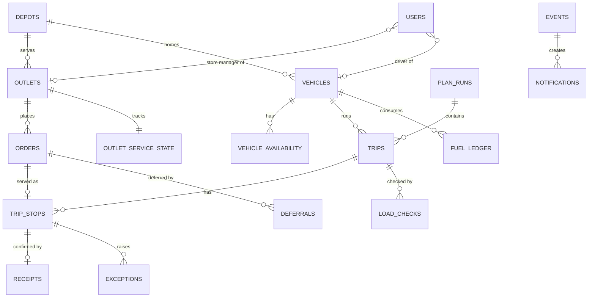

# Spec 01: Decisions, Assumptions, Domain Model, State Machines

Conforms to PROJECT_CONTEXT.md v1.0 (sections 13 and 14). Private: contains dataset derivatives.
Precedence: Booklet > datasets > Figma (Figma values are placeholders). Tags: `[OPEN]` unresolved, `[ASSUMPTION]` our choice, listed in the README.

## 1. Decisions

| ID | Decision | Status |
|----|----------|--------|
| D1 | Engine follows booklet Task 2B feasibility rules and formulas (Spec 02). Figma's mixed trips are a README departure. | Adopted |
| D2 | Order cutoff 16:00 on the day before the delivery date. Later orders roll to the next operating day with `rolled_over = true`. | Adopted |
| D3 | Weekly fuel quota enforced; Planning shows fuel remaining. | Adopted |
| D4 | **No SKU catalogue and no order line items.** An order is units, kg, m3 and one temperature, plus an optional free-text note. | Adopted |
| D5 | Deferral reasons come from checked constraints, operational reasons, and free text for manual deferrals (Spec 02 section 6). | Adopted |
| D6 | Proof of delivery = the driver's recorded outcome (who received, quantity, time) + the store manager's receipt confirmation, both offline-safe and idempotent. QR or short code is a stretch add-on, **never a hard guard**. | Adopted |
| D7 | Repo private, judges invited; email tech-triathlon@rootcode.io to confirm dataset terms. | Adopted. `[OPEN: send the email]` |
| D8 | Dashboards and counts computed from the database. | Adopted |
| D9 | One order has one temperature. A Fresh outlet's dry and chilled needs are two orders. **Only Fresh outlets may place chilled orders.** | Adopted |
| D10 | Order size entry: the store manager enters units and temperature; the server derives kg and m3 from per-brand, per-temperature unit constants calibrated once from historical orders (median kg per unit and m3 per unit). Fallback: the manager enters kg and m3. | Adopted: constants calibrated from `deliveries_train.csv` with `calibrate_unit_constants.py` (run locally; only the constants JSON is committed, repo private). `[OPEN: run it and supply the constants]` |
| D11 | All cutoff logic uses `business_now()`. With `DEMO_MODE=true` it returns a fixed time on the day before the seeded delivery day (for example 14:00), so judges can walk through at any real time. Otherwise the real Asia/Colombo clock. | Adopted |
| D12 | Engine is deterministic. On the seeded day the engine output puts the seeded store manager's outlet on a trip carried by the seeded driver's vehicle at the seeded loader's depot. A CI "golden test" enforces this. A pre-planned fallback day is also seeded. | Adopted |
| D13 | Trips can be edited until LOADED. Each edit increments `plan_version`; the loader confirms only the current version. | Adopted |
| D14 | Offline conflict policy: field facts (arrive, outcome, exception, receipt, load check) are always recorded and flagged for the dispatcher if the plan changed; server-authority commands (start trip) are rejected when stale. | Adopted |
| D15 | The Datathon is excluded from this build. | Adopted |
| D16 | Seed scope: full Peliyagoda day for the walkthrough; smaller Kandy day. | `[OPEN: confirm]` |
| D17 | Stack as in AGENTS.md / PROJECT_CONTEXT section 15. | Adopted |
| D18 | Order placement request/response rules: optional `delivery_date`, optional `note`, optional `order_weight_kg` & `order_volume_m3`. Derived from unit constants if omitted (422 if constants unconfigured). Weight & volume in responses are always non-null. Auto-picks earliest operating day before cutoff (16:00 on D-1); rolls over to next open day if cutoff passed (`rolled_over: true`, returns `requested_delivery_date`). Invalid/past/non-operating dates return 422 NOT_OPERATING_DAY. | Adopted |
| D19 | `POST /trips/{id}/confirm` transitions trip to CONFIRMED and all orders on it from PLANNED to SCHEDULED in one transaction. Adding order to confirmed trip makes it SCHEDULED immediately; removing returns it to SUBMITTED. Either bumps `plan_version`. | Adopted |
| D20 | Driver outcome mapping: `delivered` -> DELIVERED stop / DELIVERED order (`received_by`, `completed_at`, `quantity_delivered` = ordered); `partial` -> PARTIAL stop / PARTIALLY_DELIVERED order (`received_by`, `completed_at`, 0 < quantity < ordered); `refused` -> FAILED stop / DEFERRED order (`DELIVERY_FAILED`, quantity 0); `closed` -> FAILED stop / DEFERRED order (`DELIVERY_FAILED`, quantity 0). `SKIPPED` is set only by dispatcher exception skip decision (`EXCEPTION_SKIPPED`). | Adopted |
| D21 | Explicit aggregate schemas for Dashboard, Plan summary, Live monitoring (`DELAY_ALERT_MIN` config defaulting 15m), and Alerts. | Adopted |
| D22 | Cancel & Defer bodies: `POST /orders/{id}/cancel` takes `{ reason, note? }`; `POST /orders/{id}/defer` takes `{ reason_text, note? }` (sets `reason_code = MANUAL`, `reason_class = DISPATCHER`, `decided_by = dispatcher`). Both return 409 INVALID_TRANSITION when state disallows action. | Adopted |
| D23 | Role-specific read objects: `TripCard` (loader/driver lists), `TripDetail` with `StopDetail` array, `LoadListResponse`. Deterministic outlet display_names (e.g. "Fresh Colombo 03"). | Adopted |
| D24 | Token scope claims: `user_id`, `role`, `depot_ids[]` (dispatcher/loader), `outlet_id` (store manager), `vehicle_id` (driver). Replaces `users.depot_id` with `user_depot_access(user_id, depot_id)`. Depot-scoped endpoints take `depot_id` query param (defaults if user has 1 depot, 422 if missing when user has multiple, 403 FORBIDDEN_SCOPE if outside user's access). | Adopted |

## 2. Assumptions (list in README and docs)

| ID | Assumption |
|----|-----------|
| A1 | ETA rule. Fresh trip 1 departs 03:30. Trip 2 departs when trip 1 ends plus `RELOAD_BUFFER_MIN` (config, default 0). **No return journey is added** (the booklet says budgets already allow for it). Arrival at stop k = previous service end + `inter_stop_freeflow_min` (first stop: depart + `depot_to_district_freeflow_min`); service start = max(arrival, `window_open_time`); service end = start + allowance. |
| A2 | Fuel per trip = (2 x `depot_to_district_km` + `inter_stop_km` x (n - 1)) / `km_per_l`, charged to the vehicle's ISO week; counts planned, confirmed and completed trips. |
| A3 | Style and Tech trips depart so the first arrival >= its window open; trading day 09:00-17:00 (data). |
| A4 | Two clocks, one plan. H8 uses the booklet formula (no waiting) to match the organizers' validator; H11 uses the waiting-aware ETA timeline. A plan must pass both. |
| A5 | Stops within a trip ordered by earliest `window_close_time`, then earliest `window_open_time`, then `outlet_id` (determinism only; inter-stop time is constant per district). |
| A6 | Orders for a Monday delivery close Sunday 16:00 (booklet silent). Not exercised by the seeded Friday; keep in the README for completeness. |
| A7 | Planning uses free-flow times. `traffic_speed` and `road_conditions` are display or stretch only. |
| A8 | One driver per vehicle (60 synthesized); one store manager per outlet (120). Headline accounts come from this set. |
| A9 | Two orders for the same outlet on one trip are charged as two stops (formula parity). |
| A10 | A planned arrival after the window closes is a hard failure in the automatic planner. A dispatcher may override for non-mall outlets with a mandatory reason. Mall windows are never overridable. |
| A11 | `DELAY_ALERT_MIN` config defaulting to 15 minutes for live monitoring delay alerts (D21). |

## 3. Domain model

**Reference (read-only, loaded from CSV):** `depots`, `districts`, `outlets`, `vehicles`, `service_allowance`, `calendar_days`, `road_conditions`, `traffic_speed`. Vehicles have no driver column.

**Operational:**
- `users(id, username, password_hash, role, outlet_id?, vehicle_id?, display_name)`; store manager scoped to outlet, driver to vehicle.
- `user_depot_access(user_id, depot_id)`: mapping table for dispatcher and loader depot access (D24).
- `vehicle_availability(vehicle_id, date, status[available, in_workshop], note)`
- `orders(id, outlet_id, delivery_date, requested_delivery_date?, placed_at, status, temp_requirement, order_units, order_weight_kg NOT NULL, order_volume_m3 NOT NULL, rolled_over, deferral_count, cancel_reason?, note?, client_op_id?)` (brand, district, depot come from the outlet; D18)
- `outlet_service_state(outlet_id, last_served_date, last_deferred_date, consecutive_deferrals)`: source of `deferred_yesterday` and `days_since_last_served`
- `plan_runs(id, depot_id, delivery_date, status[OPEN, CLOSED], version, generated_by, generated_at, ranking_config_json, summary_json)`
- `trips(id, plan_run_id, vehicle_id, depot_id, delivery_date, trip_no[1,2], brand, district, status, plan_version, depart_time, est_minutes, est_km, est_fuel_l, confirmed_by, confirmed_at)`; unique (vehicle_id, delivery_date, trip_no)
- `trip_stops(id, trip_id, order_id UNIQUE, seq, eta, service_start_est, service_min, status, receipt_status, arrived_at, completed_at, outcome, quantity_delivered, received_by, outcome_note, device_ts)`
- `load_checks(id, trip_id, order_id, plan_version, expected_qty, loaded_qty, issue[missing, damaged], note, status[OPEN, RESOLVED], resolution[defer_order, replan_order, proceed_partial], reported_by, resolved_by)`
- `deferrals(id, order_id, from_delivery_date, reason_code, reason_class, reason_text, consequence_text, details_json, decided_by[engine, dispatcher, system], decided_by_user?, decided_at, notified_at, resolved_at, resolved_to_date)`
- `receipts(id, stop_id, outcome[full, discrepancy], note, confirmed_by, confirmed_at, qr_token?)`
- `exceptions(id, trip_id, stop_id, type[dock_blocked, outlet_closed, vehicle_issue, access_problem, other], note, reported_at, status[OPEN, DECIDED], decision[retry, skip], decision_note, decided_by, decided_at)`
- `fuel_ledger(vehicle_id, iso_year, iso_week, litres_committed)`
- `events(id, type, payload, created_at)`, `notifications(id, event_id, audience_role, audience_scope, read_at)`, `audit_events` (append-only)
- `sync_ops(client_op_id PK, device_id, client_seq, user_id, op_type, payload, client_ts, received_at, applied_at, result[applied, replayed, applied_with_conflict, rejected], reason)`

## 4. State machines

**Order:** `SUBMITTED` (acknowledged to the store manager at placement with a confirmation code) -> `PLANNED` (in a draft trip) -> `SCHEDULED` (trip confirmed) -> `LOADED` -> `IN_TRANSIT` -> `DELIVERED` | `PARTIALLY_DELIVERED`, or `DEFERRED` (refused, closed, or exception skipped).
`SUBMITTED | PLANNED | SCHEDULED -> DEFERRED` (reason mandatory; store manager notified). `DEFERRED -> SUBMITTED` when carried to the next operating day (run close or requeue; `deferral_count` retained). `SUBMITTED | PLANNED | SCHEDULED -> CANCELLED` (reason required).

**Trip:** `DRAFT -> CONFIRMED -> LOADING -> LOADED -> IN_PROGRESS -> COMPLETED`. `CONFIRMED -> LOADING` happens on `load-start`. `LOADING -> BLOCKED` on a shortfall, back to `LOADING` after the dispatcher resolves it. `CANCELLED` before departure. Edits are allowed in DRAFT, CONFIRMED, LOADING, BLOCKED (each bumps `plan_version`), not after LOADED.

**Stop:** `PENDING -> ARRIVED -> DELIVERED | PARTIAL | FAILED`. `PENDING | ARRIVED -> EXCEPTION -> PENDING (retry) | SKIPPED`. Separate `receipt_status`: `NONE, AWAITING, CONFIRMED, DISCREPANCY`.

**Vehicle-level exception `[ASSUMPTION]`:** an exception of type `vehicle_issue` applies to the whole trip: every stop not yet DELIVERED is "at risk". Decision `skip` sets all those stops SKIPPED and defers their orders (`EXCEPTION_SKIPPED`); decision `retry` returns them to PENDING. Delivered stops are never changed.

**Load check:** `OPEN -> RESOLVED` with resolution `defer_order | replan_order | proceed_partial`. **Exception:** `OPEN -> DECIDED` with decision `retry | skip`. **Deferral:** created with reason and consequence, `notified_at` set when the store manager is told, `resolved_at` and `resolved_to_date` set when the order is carried or requeued. A second consecutive deferral raises a dispatcher alert.

**Server-enforced guards:** a trip cannot be confirmed with any hard-rule violation; cannot depart while BLOCKED or before the load is confirmed at the current `plan_version`; a stop cannot be DELIVERED without `received_by` and a completion time; the fuel quota cannot be exceeded.

## 5. The seven cross-role threads (demo spine)

1. Dispatcher confirms trip, loader sees it.
2. Loader reports shortfall, dispatcher alert, departure blocked.
3. Loader confirms load, driver accepts handover and starts the route.
4. Driver exception (for example blocked dock), dispatcher live monitoring, decision recorded.
5. Dispatcher defers an order, store manager is notified.
6. Driver delivers, store manager confirms receipt or reports a discrepancy.
7. Store manager orders before the cutoff, the order appears in the dispatcher queue.

## 6. Open items

D7 email, D10 constants (run the calibration script), D16 Kandy day, exact name of the degradation scenario, team and solution names, hosting target, final seeded credentials.
